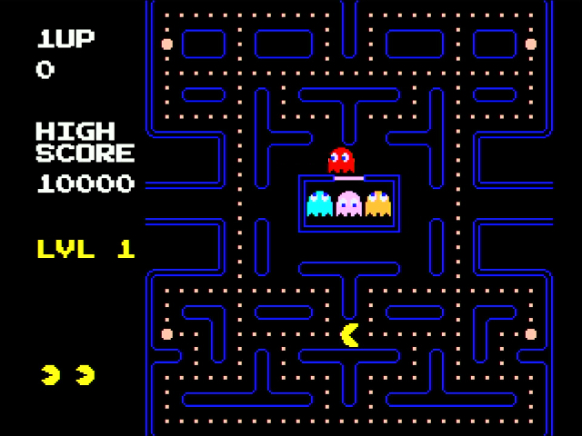

# 🕹️ Pac-Man Clone for the Adafruit Fruit Jam

A Pac-Man clone built for the **Adafruit Fruit Jam** using **CircuitPython 10**.



Originally forked from https://github.com/scarolan/pac-wio/tree/main by [TheKitty](https://github.com/TheKitty)

---

## ✨ Features

- 🎮 **Authentic Gameplay** - Classic Pac-Man mechanics including ghost AI, power pellets, and frightened mode
- 👻 **Four Unique Ghosts** - Blinky, Pinky, Inky, and Clyde with arcade-accurate behavior patterns
- 🍒 **Bonus Fruits** - Cherry, strawberry, orange, apple, and more appear as you progress
- 🔊 **Sound Effects** - Waka-waka eating sounds, death melody, and startup jingle via the built-in buzzer
- 📊 **Scoreboard** - Arcade-style display with 1UP, HIGH SCORE, lives, and current level
- 🎨 **Custom Font** - Press Start 2P retro arcade font
- ⚡ **Optimized Performance** - Runs smoothly on the Adafruit Fruit Jam

---

## 🎯 Gameplay

| Action | Keyboard | Controller |
|--------|----------|------------|
| Move Pac-Man | Arrow keys / WASD | D-pad / Joystick |
| Restart after Game Over | Space Bar | Start |
| Toggle Sound On/Off | Z / Enter | Select |
| Quit Game | Q / Escape | Home / Select+Start |
| Toggle Sound On/Off | Z / Enter | Select + A |
| Quit Game | Q / Escape | Home |
| Invert Joystick Y-Axis | | Select + B |
| Toggle Ms. Pac-Man | M | X |

### Scoring
| Item | Points |
|------|--------|
| Dot | 10 |
| Power Pellet | 50 |
| Ghost (1st) | 200 |
| Ghost (2nd) | 400 |
| Ghost (3rd) | 800 |
| Ghost (4th) | 1600 |
| Cherry | 100 |
| Strawberry | 300 |
| Orange | 500 |
| Apple | 700 |
| Melon | 1000 |
| Galaxian | 2000 |
| Bell | 3000 |
| Key | 5000 |

---

## 🛠️ Hardware Requirements

  - Adafruit Fruit Jam
  - HDMI monitor
  - Game Controller
    - Keyboard
    - Adafruit SNES controller clone
    - USB controllers supported by [usb_host_gamepad library](https://github.com/relic-se/CircuitPython_USB_Host_Gamepad)
  
  Optional
  - speaker/headphones

---

## 📦 Installation

### 1. Install CircuitPython 10

Download and install [CircuitPython 10.x for Fruit Jam](https://circuitpython.org/board/adafruit_fruit_jam/).

### 2. Install Required Libraries

Copy these libraries from the [Adafruit CircuitPython Bundle](https://circuitpython.org/libraries) to your `CIRCUITPY/lib/` folder:

- `adafruit_bitmap_font/` (folder)
- `adafruit_display_text/` (folder)

Copy these libraries from the [Adafruit Community Bundle](https://circuitpython.org/libraries) to your `CIRCUITPY/lib/` folder:

- `relic_usb_host_gamepad` (relic_usb_host_gamepad.mpy)
- `relic_usb_host_descriptor_parser` (relic_usb_host_descriptor_parser.mpy)

*Note: [circup](https://learn.adafruit.com/keep-your-circuitpython-libraries-on-devices-up-to-date-with-circup/prepare) can be used to install the required libraries as follows:
```
circup install relic_usb_host_gamepad adafruit_bitmap_font adafruit_display_text
```

### 3. Copy Game Files

Copy the entire contents of this repository to your `CIRCUITPY` drive:

```
CIRCUITPY/
├── lib/
│   ├── adafruit_bitmap_font/
│   ├── adafruit_display_text/
│   ├── relic_usb_host_gamepad.mpy
│   └── relic_usb_host_descriptor_parset.mpy
├── code.py
├── fonts/
│   └── press_start_2p.bdf
└── images/
    ├── maze_empty.bmp
    └── sprites.bmp
```
If installing for use with [Fruit Jam OS](https://learn.adafruit.com/fruit-jam-os), first create a Pac_Jam folder within the `CIRCUITPY/apps` folder and then copy the entire contents of this repository to the `apps/Pac_Jam` folder on your `CIRCUITPY` drive:
```
CIRCUITPY/
├── lib/
│   ├── adafruit_bitmap_font/
│   ├── adafruit_display_text/
│   ├── relic_usb_host_gamepad.mpy
│   └── relic_usb_host_descriptor_parset.mpy
└── apps/Pac_Jam
         ├── code.py
         ├── metadata.json
         ├── fonts/
         │   └── press_start_2p.bdf
         └── images/
             ├── icon.bmp
             ├── maze_empty.bmp
             └── sprites.bmp
```

### 4. Game Settings

The audio can be configured to use the speaker or the headphone jack and the volume level can be set by updating/creating the launcher.conf.json file located on the `CIRCUITPY/` drive:

launcher.conf.json `audio` Parameters:

    output - "speaker" or "headphone" (defaults to speaker)
    volume - 0.0 to 1.0 (defaults to 0.35)
    volume_override_danger - 0.0 to 1.0 (defaults to 0.75)

example:
```
{
  "audio" : {
    "output": "speaker",
	  "volume": 0.55,
	  "volume_override_danger": 0.75,
  },
}
```
*Note: The volume can not be set higher than the "volume_override_danger" value. It's not recommended to increase the "volume_override_danger" level unless the speaker has been tested and shown not to be over driven by the default values.

### 5. Play!

If installed to the `CIRCUYITPY/` drive, the game starts automatically when you plug in the device. If installed in the apps/Pac_Jam folder use Fruit Jam OS to start the game. Enjoy! 🎮

---

## 🎨 Technical Details

### Display
- Original Pac-Man: 224x288 pixels
- Fruit Jam 320x240 pixels (landscape mode)
- Game area is centered 

### Ghost AI
Each ghost has unique targeting behavior:
- **Blinky (Red)** - Directly chases Pac-Man
- **Pinky (Pink)** - Targets 4 tiles ahead of Pac-Man
- **Inky (Cyan)** - Complex targeting using Blinky's position
- **Clyde (Orange)** - Chases when far, scatters when close

### Ghost Modes
- **Scatter** - Ghosts retreat to corners
- **Chase** - Ghosts actively pursue Pac-Man
- **Frightened** - Blue ghosts flee (can be eaten)
- **Eaten** - Eyes return to ghost house

---

## 🤖 Built with AI Assistance

This project was developed with assistance from **GitHub Copilot** (Claude) in VS Code. The entire game was built iteratively through conversation, from basic sprite rendering to full arcade-accurate gameplay.

---

## 📜 Credits

- **Pac-Man** is a trademark of Bandai Namco Entertainment Inc.
- This is a fan-made educational project, not for commercial use
- [Press Start 2P Font](https://fonts.google.com/specimen/Press+Start+2P) by CodeMan38
- Built for the amazing [CircuitPython](https://circuitpython.org/) community

---

## 📄 License

This project is provided for educational purposes. See [LICENSE](LICENSE) for details.

---

## 🙏 Special Thanks

- [Adafruit](https://adafruit.com/) for CircuitPython and incredible learning resources
- [Seeed Studio](https://www.seeedstudio.com/) for the Wio Terminal (used with original port)
- The [Pac-Man Dossier](https://www.gamedeveloper.com/design/the-pac-man-dossier) for detailed game mechanics documentation
- Forked from https://github.com/scarolan/pac-wio/tree/main
